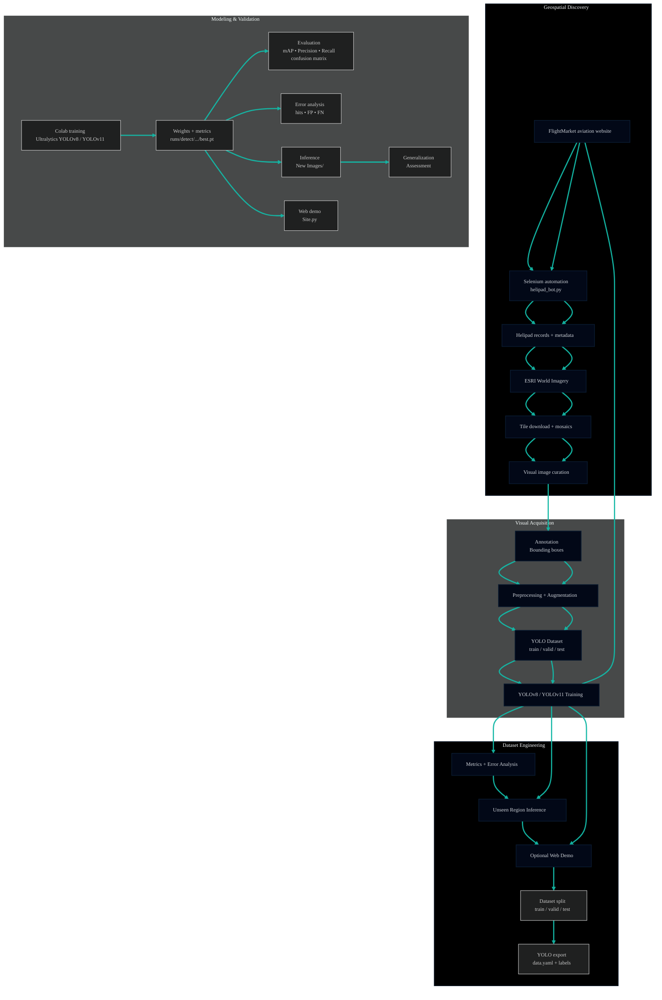

<br>

##### \[[🇧🇷 Português](README.pt_BR.md)\] \[**[🇬🇧 English](README.md)**\]   

<br><br>
<!-- -END 🇬🇧English LANGUAGE BUTTON  -->


<!-- ========= START HEADRE ========= -->
# <p align="center"> 🚁 [AI/ML]() · [Project 2]() · [Computer Vision]() · [Helipad Detector]() </p>

### <p align="center"> [***Mission:***]() Helipad Detection in São Paulo Satellite Imagery using YOLO · Responsible AI · Data Governance · LGPD </p>

<br><br>

<div align="center">

<a href="https://github.com/topics/satellite-imagery">Satellite Imagery</a>
&nbsp;&nbsp;✦&nbsp;&nbsp;
<a href="https://github.com/topics/data-visualization">Urban Analytics</a>
&nbsp;&nbsp;✦&nbsp;&nbsp;
<a href="https://github.com/topics/object-detection">Object Detection</a>
&nbsp;&nbsp;✦&nbsp;&nbsp;
<a href="https://github.com/topics/yolo">YOLO (v8 / v11)</a>
&nbsp;&nbsp;✦&nbsp;&nbsp;
<a href="https://github.com/topics/geospatial">Geospatial Intelligence</a>
&nbsp;&nbsp;✦&nbsp;&nbsp;
<a href="https://github.com/topics/governance">AI Governance</a>

</div>

<br><br>


##### <p align="center"> ⋆Some rooftops hide swimming pools.  Others hide helicopters.⋆ 

###### <p align="center">  ⟡ *Not every rooftop is just... a rooftop.*  </b> 


### <p align="center"> 🛰️


###### <p align="center"> *Finding hidden H’s in the Concrete Jungle* ⟡ </p>  <p align="center"> ⋆One rooftop at a time⋆  </p>  <p align="center"> ⚡
<p align="center">


<br>

#

<br><br>
<!-- ========= END HEADRE ========= -->


<!-- ========= START SPONSOR BADGE ========= -->
#### <p align="center"> [](https://github.com/sponsors/Mindful-AI-Assistants)

<br><br>
<!-- ========= END SPONSOR BADGE ========= -->

<!-- ========= START GIFE ========= -->
<p align="center">
   
 </p>


<br><br><br>
<!-- ========= END GIFR IMAGE ========= -->

<!-- ======================================= Start Institutional INFO ===========================================  -->
## [Institutional Information]()

[**Institution:**]() Pontifical Catholic University of São Paulo (PUC‑SP) — FACEI  
[**Course:**]() BSc in Humanistic AI & Data Science — 5th semester — 2026  
[**Subject:**]() Machine Learning / Computer Vision — YOLO  
[**Project:**]() P2 — Object Detection in Satellite Images with YOLO  

**Professor:** [✨ Rooney Ribeiro Albuquerque Coelho](https://www.linkedin.com/in/rooney-coelho-320857182/)  
**Authors:**  
- [Carlos Antonio Roth Gorham](https://github.com/RothGorham?tab=followers)   
- [Fabiana ⚡️ Campanari](https://linktr.ee/fabianacampanari)   
- [Pedro Vyctor Almeida](https://www.linkedin.com/in/pedro-vyctor-almeida-285b89273/) 


<br><br>

#

<br><br>
<!-- ========= END Institutional INFO ========= -->


<!-- ========= START Streamlit BADGE ========= -->
<p align="center" style="margin: 0;">
  <a href="https://helipoint-detector.streamlit.app" rel="noopener noreferrer">
    
  </a>
</p>

<!-- ========= END Streamlit BADGE========= -->


<!-- ========= START React Presentation BADGE ========= -->
<p align="center" style="margin: 0;">

  <a href="https://canva.link/0781blpvt3td2li" rel="noopener noreferrer">
    
  </a>
  
<!-- =========End Eeact Presentation BADGE ========= -->


<!-- ========= START Data Analysis Report BADGE ========= -->
  <a href="https://github.com/Mindful-AI-Assistants/3-project-ai-ml-yolo-helipoint-detector/blob/7afaf4db4eeaa8c385a7dbb03d58ebbbf8879a6c/data_analysing_execitiuve_%20report/%F0%9F%87%AC%F0%9F%87%A7Helipoint_Detector_Model_Performance_and_Data_Analysis.pdf" target="_blank" rel="noopener noreferrer">
    
  </a>

</p>

<br><br>

#

<br><br>

<!-- ========= START TECH STACK / PIPELINE BADGES ========= -->
<p align="center">
  
  
  
</p>

<p align="center">
  
  
  
</p>

<p align="center">
  
  
</p>


<br><br>

#

<br><br>
<!-- =========END TECH STACK / PIPELINE BADGES========= -->


<!-- ========= START NOTE ========= -->
> [!WARNING]
>
> ⚠️ Projects may be publicly shared when permitted.  
> The focus is on applied, hands-on learning with real datasets in AI governance and security contexts.  
> All sensitive content remains protected in private repositories when required.
>

<br><br>
<!-- ========= END NOTE ========= -->

<!-- =========START MAIN REPO =Projects REFERENCES ========= -->
> [!TIP]
>
> This repository is part of the flagship ecosystem:
>
> ## 🧠 AI & Machine Learning — Main Hub
>
> Explore the complete collection of projects, notebooks, research materials, analyses, and interactive applications available in the central repository:
>
> 🔗 **[AI & Machine Learning — Hub](https://github.com/Mindful-AI-Assistants/1-AI_Machine-Learning_Hub)**
>
> #
>
> ###  Related Project in this Series
>
> 🔗 **[AI/ML Project 1 · Computer Vision · EMNIST Vision Intelligence](https://github.com/Mindful-AI-Assistants/2-project-ai-ml-emnist-vision-intelligence)**
>
> A deep learning system for handwritten character recognition using PyTorch and Streamlit.
>
> #
>
> ✨ Part of the *Humanistic AI & Machine Learning Series*
>
> [*From handwriting to rooftops — simplicity was never in the roadmap.*]() ⚡️

<br><br>
<!-- =========ENDMAIN REPO =Projects REFERENCES ========= -->


> [!IMPORTANT]
>
> This repository documents an end-to-end academic project in Computer Vision for automatic 
> detection of **helipads on rooftops** using satellite images of the city of São Paulo.  
> The focus goes beyond model training: it emphasizes **dataset construction**, **annotation governance**, **reproducibility**, and
> [**evaluation on unseen neighborhoods**](), in line with the briefing of Project 2 in the Machine Learning course.

<br><br>


## [Table of Contents]()

- [Project Definition](#project-definition)
- [Objective](#objective)
- [Why Helipads?](#why-helipads)
- [Data Source](#data-source)
- [Project Context](#project-context)
- [Business and Research Problem](#business-and-research-problem)
- [Extra Automation Contribution](#extra-automation-contribution)
- [Geospatial Visualization (Kepler.gl)](#geospatial-visualization-keplergl)
- [Overall Flow Architecture](#overall-flow-architecture)
- [AI/ML Ops Pipeline](#aiml-ops-pipeline)
- [Repository Structure](#repository-structure)
- [What is `data/raw/helipad_dataset.rar`?](#what-is-helipontorar)
- [What is Roboflow in This Project?](#what-is-roboflow-in-this-project)
- [Methodology](#methodology)
- [Full Technical Pipeline](#full-technical-pipeline)
- [Image Collection and Generation](#image-collection-and-generation)
- [Annotation and Roboflow](#annotation-and-roboflow)
- [Modeling with YOLO](#modeling-with-yolo)
- [Evaluation](#evaluation)
- [Inference and Generalization](#inference-and-generalization)
- [Web Application (Optional Layer)](#web-application-optional-layer)
- [Gains from the Extra Resource](#gains-from-the-extra-resource)
- [Educational Value](#educational-value)
- [Image and Text Sources](#image-and-text-sources)
- [Technologies Used](#technologies-used)
- [How to Run](#how-to-run)
- [Deliverables Covered](#deliverables-covered)
- [Results Analysis](#results-analysis)
- [Strengths, Limitations and Future Improvements](#strengths-limitations-and-future-improvements)
- [Ethics, LGPD and Governance](#ethics-lgpd-and-governance)
- [Image Attribution](#image-attribution)
- [References](#references)
- [Acknowledgements](#acknowledgements)
- [Final Statement](#final-statement)

<br><br>

## [Project Definition]()

The **Helipoint Detector** project delivers an end-to-end **Object Detection** pipeline for identifying rooftop helipads across São Paulo using high-resolution aerial and satellite imagery with **YOLOv8/YOLOv11** models.

The repository documents the complete development workflow of an applied computer vision system, including geospatial image acquisition, automated data preparation, dataset construction, annotation, preprocessing, model training, performance evaluation, and inference on previously unseen urban areas. It also includes an optional application layer for interactive demonstrations.

Built with a focus on reproducibility and transparency, the project goes beyond the use of existing benchmarks by creating and curating an original urban dataset. The repository serves as a structured learning and research reference, demonstrating how modern object detection solutions can be designed, evaluated, and deployed using real-world geospatial data.

<br><br>


## [Objective]()

The main objective is to develop an end-to-end computer vision system capable of detecting rooftop helipads across São Paulo, covering the complete model lifecycle defined in the project scope:

[-]() programmatic acquisition of satellite data  
[-]() visual curation and tile filtering  
[-]() annotation with well-defined bounding boxes  
[-]() preprocessing and augmentations  
[-]() training and monitoring in Colab  
[-]() quantitative evaluation and qualitative error analysis  
[-]() inference on an entire neighborhood not used during training  

Beyond the technical implementation, the project was designed as an educational framework to demonstrate how real-world AI systems are built, validated, and communicated. The workflow integrates data acquisition, dataset creation, annotation, preprocessing, model development, evaluation, and lightweight deployment into a unified pipeline.

Methodologically, the project highlights that reliable computer vision performance depends primarily on data quality, annotation consistency, and geographic diversity, rather than only on architectural adjustments or model complexity.

<br><br>

## [Why Helipads?]()

Helipads are a compelling educational target because they often present a distinctive top-down geometric pattern while still being difficult enough to create realistic detection challenges.

In urban satellite imagery, helipads may be confused with rooftop structures, sports markings, bright reflective surfaces, or architectural patterns. This makes them ideal for discussing false positives, annotation quality, and model generalization.

<br><br>

## [Data Source]()

The project dataset was built from satellite imagery collected over São Paulo, with a focus on neighborhoods relevant to the academic briefing and regions where helipads are more likely to appear.

The geographical scope follows the briefing: **city of São Paulo**, focusing on neighborhoods near the PUC‑SP campus in Perdizes and regions with high helipad density, such as:

[-]() Perdizes, Higienópolis, Pacaembu and Sumaré  
[-]() Paulista Avenue, Itaim Bibi and Pinheiros  
[-]() Faria Lima, Berrini, Vila Olímpia and Brooklin  
[-]() other relevant urban areas such as Morumbi and adjacent regions  

<br><br>

## [Image sources]()

- [**ESRI World Imagery (XYZ tiles)**]()  — main source, with sub-meter resolution and programmatic HTTP access  
- [**Google Earth Web**]()  — complementary source, used only for punctual captures of specific targets, not for bulk collection  
- [**GeoSampa**]()  — mentioned as an alternative high-resolution source, possible extra beyond the base scope  

Images are stored as `.jpg` or `.png`, as required by the project.

Whenever imagery or derived mosaics are reproduced, the required attribution is:  
[***Source: Esri, Maxar, Earthstar Geographics, and the GIS User Community***.]()

<br><br>

## [Project Context]()

The work was developed in the context of **Project 2 — Object Detection in Satellite Images with YOLO**, whose briefing requires each group to:

[-]() choose [**a single target class**]()  
[-]() build an [**original dataset**]() , without using pre-made sets  
[-]() use [**ESRI World Imagery (XYZ tiles)**]()  as the main image source  
[-]() perform programmatic collection, annotation, training, evaluation and inference on an unseen neighborhood  
[-]() deliver an annotated dataset, notebooks, model weights, report and presentation  

The central pedagogical message is that **around 80% of the effort in AI is in the data, not in the architecture**. The YOLO model is practically the same for all groups; the real differentiator comes from dataset quality, manual curation and annotation consistency.

<br><br>

## [Business and Research Problem]()

Manually identifying helipads in dense urban environments is a slow, subjective and hard-to-scale task. On high-resolution imagery, rooftops with circular patterns, HVAC equipment, sport markings, shadows, reflections and urban geometry can visually resemble the characteristic helipad “H”.

This project addresses that challenge with an **Object Detection** pipeline that turns raw geospatial imagery into structured visual intelligence, reducing manual effort and enabling:

[-]() faster, more systematic helipad localization  
[-]() assessment of the model’s generalization ability across different neighborhoods  
[-]() study of error patterns in real urban contexts  
[-]() organized and reproducible data, image and evidence handling  

<br><br>

## [Extra Automation Contribution]()

Beyond the minimum briefing requirements, the group developed an **extra geospatial automation resource** to speed up helipad discovery before the annotation stage.

<br>

### [Technical title of the contribution]()

<br>

> [!TIP]
>
> 👌🏻 [**Extra Resource — Automation System to Speed Up the Search for Geographic Points and Helipads**](https://github.com/Mindful-AI-Assistants/3-project-ai-ml-yolo-helipoint-detector/tree/2013898e5ed890337f05e5778c1ddf6bab1eb897/geographical_coordinates)

<br><br>

## [Core Idea]()

Instead of relying solely on manual inspection in maps, the system:

[1.]() queries a public aviation website with airport and helipad records  
[2.]()  automates navigation and scraping with Selenium  
[3.]()  extracts geographic coordinates and metadata for each helipad  
[4.]()  converts these coordinates into geographic bounding boxes  
[5.]()  uses these boxes as input to download ESRI satellite tiles  
[6.]()  generates mosaics ready for triage, annotation and upload to Roboflow  

<br>

> [!WARNING]
>
> This resource drastically reduces target search time and strengthens construction of a broader, traceable dataset useful for future
> training cycles.


<br><br>

## [Overall Flow Architecture]()

The solution can be viewed as an architecture with **seven main blocks**:

1. [**Helipad discovery**]()  — automation on an aviation website to locate records with coordinates  
2. [**Geographic extraction**]()  — conversion and normalization of coordinates to usable decimal format  
3. [**Geographic perimeter generation**]()  — creation of bounding boxes around each point  
4. [**Visual acquisition**]()  — download of ESRI World Imagery satellite tiles based on these boxes  
5. [**Visual triage**]()  — manual selection of crops with clear helipad presence  
6. [**Annotation and versioning**]()  — use of Roboflow for labeling, preprocessing, splits and augmentations  
7. [**Training, evaluation and inference**]()  — YOLO training in Colab, performance measurement and generalization tests on unseen neighborhoods  

<br><br>

## [AI/ML Ops Pipeline]()

<br>



<br>

> [!TIP]
>
> The pipeline should be understood as a learning architecture as much as a software architecture.It shows how raw geospatial imagery is gradually transformed into a validated and demonstrable AI artifact.

<br><br>

## [Repository Structure]()

The repository structure was organized to reflect pipeline stages, including geographic automation, image generation, training, inference, evaluation and documentation.

<br>

```bash
helipoint-detector/
├── .devcontainer/
│   └── devcontainer.json
├── .github/
├── apps/
│   └── streamlit_app/
│       └── app.py                          # auto-discovers any experiment under artifacts/runs/detect/
├── artifacts/
│   └── runs/
│       └── detect/
│           ├── exp1/                       # src/training/yolo_training_exp1.ipynb (dataset v1)
│           │   ├── weights/{best.pt,last.pt}
│           │   ├── results.csv
│           │   └── *.png (loss curves, confusion matrix, labels.jpg, ...)
│           └── exp2/                       # optional: add a second experiment here later,
│                                              # the app picks it up automatically, no code change needed
├── briefing/
│   ├── geo_reference/
│   │   ├── T_ORTO_3315-264_IRGB_1000.j2w
│   │   └── T_ORTO_3315-264_IRGB_1000.jp2
│   ├── briefing_pt.pdf
│   ├── briefing_en.pdf
│   └── notebooks/
│       ├── mosaic_perdizes.ipynb
│       └── mosaic_perdizes_hires.ipynb
├── configs/
│   └── data.yaml
├── data/
│   ├── README.dataset.txt
│   ├── README.roboflow.txt
│   ├── raw/
│   │   └── helipad_dataset.rar             # originally "Heliponto.rar" before renaming
│   ├── tiles/
│   │   ├── center_hires_annotated_mosaic.png
│   │   ├── center_hires_full_mosaic.jpg
│   │   ├── center_hires_mosaic_preview.jpg
│   │   ├── center_hires_tiles_sample.png
│   │   ├── center_mosaic_tiles/
│   │   └── tile_z19_x*_y*.jpg
│   ├── inference/
│   │   └── unseen_neighborhood/
│   └── training/
│       └── yolo_dataset/
│           ├── data.yaml
│           ├── train/{images,labels}
│           ├── valid/{images,labels}
│           └── test/{images,labels}
├── docs/
│   ├── mlops_architecture.md
│   └── governance/
│       └── agentic_web_economic_governance_global_south.pdf
├── notebooks/
│   └── model_analysis.ipynb
├── reports/
│   ├── executive_analysis/
│   │   ├── helipoint_detector_performance_pt.pdf
│   │   └── helipoint_detector_performance_en.pdf
│   ├── model_outputs/
│   │   └── detect/
│   └── yolo_results_analysis.md
├── src/
│   ├── data_preparation/
│   │   └── image_preprocessing.ipynb
│   ├── geospatial/
│   │   ├── geospatial_image_collection.ipynb
│   │   ├── helipad_scraper.py
│   │   ├── helipad_coordinates_raw.csv
│   │   ├── helipad_coordinates_bbox.csv
│   │   └── transform_coordinates.py
│   └── training/
│       └── yolo_training.ipynb
├── packages.txt
├── requirements.txt
```

<br>

> [!TIP]
>
> This organization facilitates navigation, reproducibility and project evolution, clearly separating collection, preprocessing, training, inference and application.


<br><br>

## [What is `Heliponto.rar`?]()

`Heliponto.rar` is the compressed annotated dataset used in the project workflow.

It is not a prebuilt third-party benchmark. Instead, it represents the packaged output of the group’s own dataset-building process: programmatic tile acquisition, manual curation, annotation, export in YOLO-compatible format, and organization for training reuse.

This distinction is academically important because it makes clear that the dataset itself is part of the project deliverable, not an external shortcut.

<br><br>

## [What is Roboflow in This Project?]()

In this project, **Roboflow** was used as the annotation and dataset management platform rather than as the origin of the imagery.

Its role was to support image upload, bounding-box labeling, dataset versioning, augmentation, train/validation/test splitting, and export in YOLOv8-compatible format. In practical terms, Roboflow bridges the gap between raw tiles and a training-ready object detection dataset.

<br><br>

## [Methodology]()

The project follows an end-to-end methodology aligned with educational best practices in applied Computer Vision.

1. [**Data collection**:]() satellite tiles are collected programmatically from ESRI World Imagery.  <br>
2. [**Manual curation**:]() irrelevant tiles are discarded to improve dataset quality.  
3. [**Annotation**:]() helipads are labeled with tight bounding boxes in Roboflow.  
4. [**Preprocessing**:]() the dataset is standardized and split into training, validation, and test subsets.  
5. [**Training**:]() a YOLO model is trained in a GPU-enabled environment.  
6. [**Evaluation**: performance is examined with metrics and qualitative error analysis.  
7. [**Inference**:]() the trained model is applied to unseen images and new geographic areas.  
8. [**Application layer**:]() a lightweight interface makes the model easier to demonstrate and inspect.


<br>

> [!IMPORTANT]
>
>   This methodology highlights a key lesson in AI education: the quality of results is strongly influenced by data engineering and
>   annotation decisions, not only by the network architecture.


<br><br>


## [Full Technical Pipeline]()

The Helipoint Detector technical pipeline can be summarized in 12 steps:

[1.]() Discover helipad records on an aviation website <br>
[2.]() Extract coordinates and location information <br>
[3.]() Save and organize the data in `cordenadasheli.csv` <br>
[4.]() Convert coordinates into geographic bounding boxes <br>
[5.]() Download ESRI World Imagery satellite tiles <br>
[6.]() Build mosaics per neighborhood or region <br>
[7.]() Manually triage mosaics, keeping only images with helipads <br>
[8](). Upload selected images to Roboflow <br>
[9.]() Annotate helipads with consistent bounding boxes <br>
[10.]() Generate dataset versions with resize, splits and augmentations, exporting in YOLO format <br>
[11.]() Train YOLO models in Colab, monitoring metrics and train/validation curves <br>
[12.]() Run inference on unseen neighborhoods and analyze results

<br>

> [!TIP]
>
> This turns a manual, scattered search into a more scalable, traceable and reproducible process.


<br><br>

## [Image Collection and Generation***]()

### [***Programmatic collection (ESRI World Imagery)***]()

Programmatic collection follows the XYZ tile pattern of the **ESRI World Imagery** public service, as recommended in the briefing:

[-]() define [**zoom**]() by target type
[-]() use `z = 19` for helipads and other small targets
[-]()define **bounding boxes** per neighborhood `(lon_min, lat_min, lon_max, lat_max)`
[-]() convert bounding boxes to tile indices `(z, x, y)` via a `deg2tile` function
[-]() download each tile, checking HTTP status and filtering placeholders
[-]() organize tiles into folders by neighborhood and zoom

<br>

> [!TIP]
>
> The `Imagens.ipynb` notebook generalizes this flow for multiple coordinates and bounding boxes, reading `cordenadasheli.csv` and producing > mosaics and crops ready for triage.

<br><br>

### [***Complementary manual collection (Google Earth Web***]()

In some cases, **Google Earth Web** may be used as a complement:

[-]() only for specific helipad examples
[-]() preserving consistent zoom
[-]() cropping approximately square areas and resizing to `640×640`

<br>

> [!TIP]
>
> Bulk screenshot collection from Google is not used, in line with usage restrictions and the briefing.

<br><br>

### [***Curation and dataset volume***]()

In alignment with the project:

[-]() minimum volume of **200 images with the target object** after curation
[-]() geographical diversity with **at least 3 different neighborhoods** in training
[-]() holdout of at least **1 fully unseen neighborhood** for final generalization testing
[-]() manual triage of tiles, discarding crops without helipads

<br>

> [!TIP]
>
> Curation is not only an operational step; it is also part of the academic evaluation.

<br><br>

## [Annotation and Roboflow]()

Image annotation was carried out with focus on consistency and alignment with course rules.

<br>

### [***Annotation Tool***]()

[**Roboflow**]() is used as the central platform for:

[-]() uploading selected images
[-]() drawing bounding boxes
[-]() standardizing labels (a single class: helipad)
[-]() resizing to `640×640`
[-]() data augmentation and version creation
[-]() splitting into `train / valid / test`
[-]() exporting in **YOLOv8/YOLOv11** format

<br>

> [!TIP]
>
> Other tools like CVAT.ai are compatible, but the main flow is structured around Roboflow for simplicity.

<br>

### [***Annotation Standards***]()

[-]() single target class <br>
[-]() [**tight**]() bounding boxes, without excessive area <br>
[-]() written criteria for partially visible objects, shadows, reflections and ambiguous cases <br>
[-]() annotation work shared across team members, not concentrated in a single person

<br>

### [***Preprocessing and Splits***]()

In Roboflow, the following were configured:

[-]() resize to `640×640` <br>
[-]()augmentations such as 90° rotations, horizontal/vertical flips and small brightness/contrast changes <br>
[-]() standard splits: <br>
  - [**70% train**]()
  - [**20% validation**]()
  - [**10% test**]()
 
<br>

### [***The final export produces the structure expected by YOLO:***]()

<b>

```bash
dataset/
├── data.yaml
├── train/
│   ├── images/
│   └── labels/
├── valid/
│   ├── images/
│   └── labels/
└── test/
    ├── images/
    └── labels/
```

<br>

> [!TIP]
>
> Each `.txt` in `labels/` contains, per line, normalized coordinates `(class_id, x_center, y_center, width, height)`.

<br><br>

## [Modeling with YOLO]()

Detector training was done with **Ultralytics YOLO** on Google Colab with a T4 GPU, following briefing recommendations.

<br>

### [***Training stack***]()

[-]() Python 3.x <br>
[-]() PyTorch <br>
[-]() `ultralytics` library <br>
[-]() `roboflow` library for dataset integration <br>
[-]() Jupyter Notebook / Google Colab Free (T4 GPU)

<br>

### [***Base Configuration***]()

Example snippet used in the notebooks:

<br>

```python
!pip install -q ultralytics roboflow

from ultralytics import YOLO

model = YOLO('yolov8n.pt')  # or 'yolo11n.pt'

results = model.train(
    data='data.yaml',
    epochs=30,
    imgsz=640,
    batch=16,
    device=0,
    seed=42,
    project='runs',
    name='exp1'
)
```

<br>

### [***Experiment Strategy***]()

n line with the briefing, **at least two experiments** were run, varying one hyperparameter at a time (for example, `epochs`, `batch` or `imgsz`) and comparing results.

All relevant hyperparameters are recorded to allow pipeline re-execution, and YOLO automatically saves the best checkpoint to:

```bash
runs/detect/exp1/weights/best.pt
```

<br><br>

## [Evaluation]()

Model evaluation is carried out on two complementary fronts: [**quantitative metrics**](0 and [**qualitative analysis**]().

<br>

### [***Quantitative Metrics***]()

The following are analyzed:

- [**mAP@0.5**]()
- [**mAP@0.5:0.95**]()
- [**Precision (P)**]()
- [**Recall (R)**]()
- [**Confusion matrix**]()

Additionally, curves are inspected for:

- [**loss**]() (box, cls, dfl) per epoch
- [**Precision / Recall**]() across training

<br>

### [***Key Concepts***]()

- [**Precision**:]() proportion of positive detections that are correct
- [**Recall**:]()  proortion of real objects detected by the model
- [**mAP]()  mean Average Precision across IoU thresholds
- [**IoU (Intersection over Union)**:]()  overlap between predicted and annotated boxes
- [**False Positive (FP)**:]()  model detects a helipad where there is none
- [**False Negative (FN)**:]()  model fails to detect a real helipad
- [**Generalization**:]()  ability to work on new, unseen data

<br>

### [***Qualitative Analysis***]()

In line with the briefing, the project performs visual analysis of:

- at least [**5 clear hits**]()
- [**3 false positives**]()
- [**3 false negatives**]()

Always with plausible explanations for each error pattern, relating background texture, “H” contrast, viewing angle, image quality and diversity of similar examples in training.

This dual perspective is especially useful in educational settings because it helps beginners understand that model quality is not captured by a single number.

<br><br>

## [Inference and Generalization]()


ne of the most important parts of the project is testing whether the model generalizes to regions not seen during training.

### [Inference on an unseen neighborhood]()

The pipeline includes:

1. generating mosaics for a **neighborhood entirely excluded from training**
2. running the YOLO model on **all tiles** of this mosaic
3. discussing in the report/notebook at least **5 tiles** with hits, false positives and false negatives

Example inference code:

```python
from ultralytics import YOLO

model = YOLO('runs/detect/exp1/weights/best.pt')

results = model.predict(
    source='New Images/',
    save=True,
    conf=0.25
)
```


<br><br>
<br><br>
<br><br>
<br><br>
<br><br>
<br><br>
<br><br>


## 💌 [Let the data flow... Ping Us !](mailto:fabicampanari@proton.me)

<br>


#### <p align="center">  🛸๋ My Contacts [Hub](https://linktr.ee/fabianacampanari)


<br>

### <p align="center"> 


<br><br>

<p align="center">  ────────────── ⊹🔭๋ ──────────────

<!--
<p align="center">  ────────────── 🛸๋*ੈ✩* 🔭*ੈ₊ ──────────────
-->

<br>

<p align="center"> ➣➢➤ <a href="#top">Back to Top </a>
  

  
#
 
##### <p align="center">Copyright 2026 Mindful-AI-Assistants. Code released under the  [MIT license.](https://github.com/Mindful-AI-Assistants/3-project-ai-ml-yolo-helipoint-detector/blob/75176e7db4c9e30033f64a00f783a8897ad129d1/license.md)


