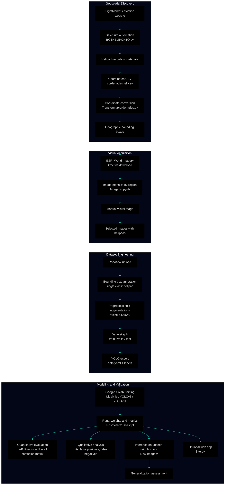

<!--START  🇬🇧English LANGUAGE BUTTON  -->
##### \[[🇧🇷 Português](README.pt_BR.md)\] \[**[🇬🇧 English](README.md)**\]   
<!--END 🇬🇧English LANGUAGE BUTTON  --  -->


<br><br>


<!-- ========= START HEADRE ========= -->
# <p align="center"> 🚁  [Helipad Detector]()

### <p align="center"> End-to-End Artificial Intelligence Platform for Automated Helipad Detection and Geospatial Intelligence from Satellite Imagery

<br>

<div align="center">

<a href="https://github.com/topics/satellite-imagery">Satellite Imagery</a>
&nbsp;&nbsp;✦&nbsp;&nbsp;
<a href="https://github.com/topics/data-visualization">Urban Analytics</a>
&nbsp;&nbsp;✦&nbsp;&nbsp;
<a href="https://github.com/topics/object-detection">Object Detection</a>
&nbsp;&nbsp;✦&nbsp;&nbsp;
<a href="https://github.com/topics/yolo">YOLO (v8 / v11)</a>
&nbsp;&nbsp;✦&nbsp;&nbsp;
<a href="https://github.com/topics/geospatial">Geospatial Intelligence</a>

</div>

<br><br>


<!-- ========= START TEASER ========= -->
###### <p align="center"> <i>Teaching YOLO to spot the city's most exclusive landing spots.</i> ✨</p> 

###### <p align="center"> 🚁 ***Finding hidden H’s in the concrete jungle*** <br>

###### <p align="center">One rooftop at a time. <br> 

#### <p align="center"> ⚡️


<br>

#

<br><br>
<!-- ========= END TEASER ========= -->


<!-- ========= START SPONSOR BADGE ========= -->
<p align="center">

  <a href="https://github.com/sponsors/Mindful-AI-Research">
    
  </a>

  
<br><br>
<!-- ========= END SPONSOR BADGE ========= -->


<!-- ========= START PUC GIF ========= -->
<p align="center">
   
 </p>

 <br>
<!-- ========= END PUC GIF ========= -->


<!-- ========= START 🇧🇷 Top CommtributorsE ========= 
<p align="center">
  <a href="https://user-badge.committers.top/brazil/FabianaCampanari">
    
    
  </a>
</p>

</p>

<br><br><br>
========= END 🇧🇷 Top CommtributorsE  ========= -->


<!-- ========= START Institutional INFO ========= -->
[**Institution:**]() Pontifical Catholic University of São Paulo (PUC-SP) <br>
[**School:**]() FACEI — Computer Science Department <br>
[**Course:**]() BSc in Human-Centered AI & Data Science <br>
[**Subject:**]() Machine Learning / Computer Vision — YOLO <br>
[**Project:**]() Object Detection in Satellite Images with YOLO <br>
**Author:** [Fabiana ⚡️ Campanari](https://linktr.ee/fabianacampanari) <br>
**Collaborators:** [Carlos Antonio dos Santos Roth Gorham]() · [Pedro Vyctor Almeida](https://github.com/ppvyctor/Helipoint-Detector) 

# <br>
<!-- ========= END Institutional INFO ========= -->

<!-- ======================================= Start Institutional  Atribuição de Contribuições / subm tidd ======== -->
### [Contribution Attribution]()

This project evolved from an initial foundation involving dataset development, model training, and a web prototype into an end-to-end computer vision and geospatial intelligence platform. The three credited contributors participated at different stages of the project, with contributions spanning distinct technical areas and responsibilities. <br><br>

* [Pedro Vyctor Almeida](https://github.com/ppvyctor/Helipoint-Detector) established the initial foundation of the project, including the original annotated dataset, the initial web application prototype (`Site.py`), and the first training experiment (`exp1`). His prototype consisted of a compact Streamlit application with two main functions: image upload and regional satellite-image search. The original work is documented in his [Helipoint Detector repository](https://github.com/ppvyctor/Helipoint-Detector). <br><br>

* [**Carlos Antonio dos Santos Roth Gorham**]() proposed the concept of geospatial automation for helipad discovery and contributed to the initiation of this implementation direction. <br><br>

* [Fabiana ⚡️ Campanari](https://linktr.ee/fabianacampanari) contributed to the subsequent development, expansion, integration, evaluation, and consolidation of the final **Helipad Detector** platform. Her work included: <br>

  * development and expansion of geospatial scraping and geocoding automation;
  * conversion of raw geographic coordinates into decimal coordinates and bounding boxes;
  * integration of satellite imagery acquisition and geographic search workflows;
  * execution of experiments `exp2` and `exp3`;
  * model benchmarking, comparative evaluation, and performance analysis;
  * comparison of trained models using Precision, Recall, mAP@50, mAP@50–95, training curves, and confusion matrices;
  * comparative evaluation of the three experiments using the same real-world field-validation dataset;
  * analysis of the difference between curated benchmark performance and generalization on uncurated satellite imagery;
  * field validation across ten São Paulo regions using more than 7,900 real satellite tiles;
  * expansion of the initial two-tab prototype into a substantially larger bilingual Streamlit platform;
  * implementation of automatic model discovery and selectable experiment weights;
  * development of interactive maps, geographic layers, heatmaps, regional summaries, and detection-rate visualizations;
  * implementation of sample-image inference, upload inference, regional satellite search, and downloadable detection results;
  * development of governance, transparency, Responsible AI, LGPD, limitations, and human-oversight sections;
  * implementation of bilingual PT/EN interface support;
  * complete visual design, interface architecture, layout, styling, interaction design, and user experience of the dashboard;
  * organization and consolidation of the complete final repository;
  * creation of the interactive React/HTML executive presentation;
  * preparation of the complete bilingual technical reports, guides, documentation, demonstrations, and supporting materials;
  * development of the project's presentation layer, visual storytelling, interactive elements, and soundtrack integration;
  * market research and comparative analysis of helicopter-presence and activity indicators, including the international comparative ranking used to contextualize the project's practical relevance. <br><br>

The final repository represents the evolution of the project from its initial prototype into an integrated computer vision and geospatial intelligence platform, encompassing data discovery, geospatial automation, experimentation, model benchmarking, comparative evaluation, field validation, visualization, governance, documentation, presentation, and applied contextual research.

**All three contributors remain credited for their respective contributions. This attribution is provided to transparently document the project's development history, the evolution of its implementation, and the technical areas contributed by each participant.**


<br>

#

<br><br><br>
<!-- ======================================= END Institutional / mestr/ SUBMISSION =========================================== --> 


<!-- ========= START Streamlit BADGE ========= -->
<p align="center" style="margin: 0;">
  <a href="https://helipad-detector-sp.streamlit.app/" rel="noopener noreferrer">
    
  </a>
</p>
<!-- ========= END Streamlit BADGE ========= -->

<!-- ========= START React Presentation BADGE ========= -->
<p align="center" style="margin: 0;">

  <a href="https://mellow-salamander-f81315.netlify.app/" target="_blank" rel="noopener noreferrer">
    
  </a> 
<!-- =========End REeact Presentation BADGE ========= -->

<!-- ========= START Helipad Detector Full Report BADGE ========= -->
  <a href="https://github.com/Mindful-AI-Research/3-project-ai-ml-yolo-helipad_detector/blob/c912be5be23e6f11f77a4125d1ef774e3b5e6310/reports/helipad_detector_full_report/%F0%9F%87%AC%F0%9F%87%A7Helipad_Detector_Full_Report.pdf" target="_blank" rel="noopener noreferrer">
    
  </a>

</p>
<!-- ========= END Helipad Detector Full Report BADGE ========= -->

<br><br>

#

<br><br>
<!-- ========= BADGES  END ALLL PRESENTATIONS ------ BADGES  ========= -->


<!-- 🚧<!-- ========= START 🎥 **DEMO** ========= 
### 🎥 **DEMO: RESTful API & Dashboard Deployment** ✧ ` * Geocoding: Nominatim (OpenStreetMap)` ✧ ` MapLibre GL JS` ✧ `Streamlit`

## Dashboard Preview

###### <p align="center"> 🎬 **Creative Direction, Music Curation & Editing by Fab⚡️**
###### <p align="center"> 🎶 **Soundtrack:** *"Canon in D"* — Johann Pachelbel

<br>

#

<br><br>
=========🚧 END 🎥 **DEMO** =========  -->


<!-- ========= START TECH STACK / PIPELINE BADGES ========= -->
<p align="center">
  
  
  
</p>

<p align="center">
  
  
  
</p>

<p align="center">
  
  
</p>


<br><br>

#

<br><br>
<!-- =========END TECH STACK / PIPELINE BADGES========= -->


<!-- ========= START NOTE ========= -->
> [!WARNING]
>
> ⚠️ Projects may be publicly shared when permitted.  
> The focus is on applied, hands-on learning with real datasets in AI governance and security contexts.  
> All sensitive content remains protected in private repositories when required.
>

<br><br>

#

<br><br>
<!-- ========= END NOTE ========= -->

<!-- =========START MAIN REPO =Projects REFERENCES ========= -->
> [!TIP]
>
> This repository is part of the flagship ecosystem:
>
> ## 🧠 AI/ML ✦ Neural Networks  ✦ Hub   ✦
> 
> Explore the complete collection of projects, notebooks, research materials, analyses, and interactive applications available in the central repository:
>
> 🔗 **[AI/ML ✦ Neural Networks ✦ Hub](https://github.com/Mindful-AI-Research/1-ai-ml_neural-networks_hub)**
>
> #
>
> ###  Related Project in this Series:
>
> 🔗 **[AI/ML Project 1 · Computer Vision · EMNIST Vision Intelligence](https://github.com/Mindful-AI-Assistants/2-project-ai-ml-emnist-vision-intelligence)**
>
> A deep learning system for handwritten character recognition using PyTorch and Streamlit.


<br><br><br><br>
<!-- =========END MAIN REPO =Projects REFERENCES ========= -->


<!-- ========= START Overview ========= -->
## [Overview]()

[**Helipad Detector**]() is an end-to-end Artificial Intelligence and Computer Vision platform designed to automatically detect and map **potential rooftop helipads** from satellite imagery. The project transforms geospatial imagery into structured information, enabling the identification of visual patterns compatible with helicopter landing areas and their representation on an interactive map.

The project focuses on [**São Paulo, Brazil**](https://www.prefeitura.sp.gov.br/), an urban environment particularly relevant to this type of application. The city is widely recognized for having one of the world's largest urban helicopter fleets. Industry sources report more than **400 registered helicopters**, alongside a network of more than **260 helipads**; operational estimates vary depending on the period and geographic scope, reaching approximately **2,200 takeoffs and landings per day** across the metropolitan area. [São Paulo: the city of helicopters — Folha de S.Paulo](https://www1.folha.uol.com.br/tv/2026/04/sao-paulo-a-cidade-dos-helicopteros.shtml) · [São Paulo has the world's largest helicopter fleet — Exame](https://exame.com/casual/sao-paulo-tem-a-maior-frota-de-helicopteros-do-mundo-e-a-segunda-em-jatos/) · [Helicopter fleet data in São Paulo — Avantto](https://www.avantto.com.br/blog/business/parabens-sao-paulo/)

To manage this highly complex airspace environment, the city relies on [**HELICONTROL**](https://www.fab.mil.br/noticias/imprime/42060/CONTROLE%20DO%20ESPA%C3%87O%20A%C3%89REO%20-%20HELICONTROL:%20Seguran%C3%A7a%20e%20fluidez%20no%20controle%20de%20helic%C3%B3pteros%20em%20S%C3%A3o%20Paulo), a service developed by the [**Brazilian Air Force (FAB)**](https://www.fab.mil.br/) through the [**Department of Airspace Control (DECEA)**](https://www.decea.mil.br/). Operating within the context of the Congonhas Control Tower, the system coordinates helicopter traffic and contributes to the safe coexistence of helicopter operations with regular aircraft traffic. [DECEA operates helicopter air traffic control — FAB](https://www.fab.mil.br/noticias/imprime/42044/SEGURAN%C3%87A%20DE%20VOO%20-%20DECEA%20atua%20no%20Controle%20de%20Tr%C3%A1fego%20A%C3%A9reo%20de%20Helic%C3%B3pteros%20do%20Brasil) · [CRCEA-SE — DECEA](https://www.decea.mil.br/?i=unidades&p=crcea-se)

These conditions make São Paulo a challenging real-world setting for AI-based geospatial intelligence applications. **Helipad Detector does not perform air traffic control** and does not replace operational systems such as HELICONTROL. Its purpose is to support infrastructure mapping by identifying, from satellite imagery, locations with visual characteristics compatible with helipads and organizing this information as geospatial data for urban analysis, academic research, and future Smart City applications.

The platform implements a complete AI workflow, including public data collection, geocoding, satellite imagery acquisition, manual annotation with [**Roboflow**](https://roboflow.com/), training with [**Ultralytics YOLOv8**](https://docs.ultralytics.com/models/yolov8/) and [**Ultralytics YOLO11**](https://docs.ultralytics.com/models/yolo11/), as well as real-world validation across more than **7,900 satellite tiles**. Its interactive dashboard provides access to the pipeline, datasets, performance results, and identified limitations, reinforcing principles of reproducibility, explainability, and Responsible AI.

<br><br>

<!-- ========= START Contexto Global  ========= -->
## [Global Helicopter Traffic Context — Why São Paulo?]()

São Paulo's selection is not incidental. Major metropolitan areas such as New York, Tokyo, Rio de Janeiro, London, Mexico City, and Bogotá use helicopters for varying combinations of executive transportation, tourism, medical emergencies, public safety, government services, and specialized operations.

São Paulo, however, stands out through the combination of a large urban helicopter fleet, high building density, a significant presence of rooftop helipads, and a daily operational volume that requires specialized management. The existence of **HELICONTROL** demonstrates the practical complexity of this aerial mobility environment and reinforces the relevance of using the city as a case study for the automated detection of potential helipads.

<br>

| City                                                                                                | Country             | Helicopter Air Mobility Context                                                            | Reference Source                                                                                       |
| --------------------------------------------------------------------------------------------------- | ------------------- | ------------------------------------------------------------------------------------------ | ------------------------------------------------------------------------------------------------------ |
| [**São Paulo**](https://www1.folha.uol.com.br/tv/2026/04/sao-paulo-a-cidade-dos-helicopteros.shtml) | 🇧🇷 Brazil         | More than 400 registered helicopters, over 260 helipads, and high daily operational volume | [Folha de S.Paulo](https://www1.folha.uol.com.br/tv/2026/04/sao-paulo-a-cidade-dos-helicopteros.shtml) |
| [New York](https://www.nyc.gov/site/edc/index.page)                                                 | 🇺🇸 United States  | Tourist, executive, medical, and urban mobility operations                                 | [NYC Economic Development Corporation](https://www.nyc.gov/site/edc/index.page)                        |
| [Tokyo](https://www.mlit.go.jp/en/)                                                                 | 🇯🇵 Japan          | Corporate, emergency, security, and specialized transport operations                       | [Ministry of Land, Infrastructure, Transport and Tourism](https://www.mlit.go.jp/en/)                  |
| [Rio de Janeiro](https://www.gov.br/anac/pt-br)                                                     | 🇧🇷 Brazil         | Executive aviation, urban transport, and offshore-related operations                       | [ANAC](https://www.gov.br/anac/pt-br)                                                                  |
| [London](https://londonheliport.co.uk/)                                                             | 🇬🇧 United Kingdom | Executive aviation market and urban heliport infrastructure                                | [London Heliport](https://londonheliport.co.uk/)                                                       |
| [Belo Horizonte](https://www.gov.br/anac/pt-br)                                                     | 🇧🇷 Brazil         | Corporate operations and executive aviation                                                | [ANAC](https://www.gov.br/anac/pt-br)                                                                  |
| [Santiago](https://www.dgac.gob.cl/)                                                                | 🇨🇱 Chile          | Executive, corporate, and specialized operations                                           | [DGAC Chile](https://www.dgac.gob.cl/)                                                                 |
| [Mexico City](https://www.gob.mx/afac)                                                              | 🇲🇽 Mexico         | Executive transport, government, and security operations                                   | [AFAC Mexico](https://www.gob.mx/afac)                                                                 |
| [Bogotá](https://www.aerocivil.gov.co/)                                                             | 🇨🇴 Colombia       | Executive, emergency, and special-service operations                                       | [Aerocivil Colombia](https://www.aerocivil.gov.co/)                                                    |
| [Beijing](https://www.caac.gov.cn/EN/)                                                              | 🇨🇳 China          | Government, executive, and specialized service operations                                  | [CAAC China](https://www.caac.gov.cn/EN/)                                                              |

<br><br>

> [!TIP]
> São Paulo is the focus of **Helipad Detector** because of its combination of high urban density, extensive building concentration, rooftop helipad infrastructure, and intensive helicopter traffic. The project uses this context to demonstrate how Computer Vision and satellite data can support automated urban infrastructure mapping. Model detections represent **visual candidates** and do not constitute regulatory, operational, or aeronautical confirmation of the existence of a helipad.

<br><br><br>
<!-- ========= END Contexto Global  ========= -->


<!-- ======== START Key Features  ========= -->
## [Key Features]()

[-]() End-to-end Artificial Intelligence and Computer Vision pipeline <br>

[-]() Automated satellite imagery acquisition and preprocessing <br>

[-]() Geospatial intelligence and spatial data processing workflow <br>

[-]() YOLOv8n / YOLO11n object detection <br>

[-]() Roboflow-based image annotation and dataset preparation <br>

[-]() Interactive geospatial maps with MapLibre GL JS + OpenStreetMap <br>

[-]() Automated geocoding with Nominatim (OpenStreetMap) <br>

[-]() Real-world validation across 7,900+ satellite tiles from 10 São Paulo neighborhoods <br>

[-]() Interactive Streamlit web application and dashboard <br>

[-]() Fully reproducible research repository <br>

[-]() Downloadable datasets, notebooks and generated artifacts


<br>

#

<br><br>
<!-- ========= END Key Features ========= -->

 
<!-- ========= START 🎥 **DEMO** ========= -->
###### <p align="center">  🎥 **DEMO:** **HELIPAD DETECTION** ✧ `YOLO11` ✧ `MODEL TRAINING`  

https://github.com/user-attachments/assets/5b7d581c-ab5e-416e-8471-d91136b2ada0

###### <p align="center"> 🎶 *Feel Good* by Nina Simone - Deep House  Remix  ✧ *Creation by Fabi* ⚡️

<br><br>

#

<br><br>
<!-- ========= END  🎥 **DEMO** ========= -->


<!-- ========= START 🎥 **DEMO** `AUTOMATED HELIPAD SCRAPING` ========= -->
###### <p align="center"> 🎥 **DEMO:** **AUTOMATED HELIPAD SCRAPING** ✧ `SELENIUM` ✧ `FLIGHTMARKET` ✧ `GEOCODING` ✧ *Creation by Fabi* ⚡️

https://github.com/user-attachments/assets/eab6e951-6b66-4c6c-a2c6-23ee2f902c5f

<br><br><br><br><br>
<!-- ========= END  🎥 **DEMO** ========= -->


<!-- ========= START ToC-->
##  Table of Contents

- [Global Helicopter Traffic Context — Why São Paulo?](#global-helicopter-traffic-context--why-são-paulo)
- [Project Definition](#project-definition)
- [Objective](#objective)
- [Why Helipads?](#why-helipads)
- [Data Source](#data-source)
- [Project Context](#project-context)
- [Business and Research Problem](#business-and-research-problem)
- [Extra Automation Contribution](#extra-automation-contribution)
- [Geospatial Visualization (Kepler.gl)](#geospatial-visualization-keplergl)
- [Overall Flow Architecture](#overall-flow-architecture)
- [AI/ML Ops Pipeline](#aiml-ops-pipeline)
- [Repository Structure](#repository-structure)
- [What is `data/raw/helipad_dataset.rar`?](#what-is-helipontorar)
- [What is Roboflow in This Project?](#what-is-roboflow-in-this-project)
- [Methodology](#methodology)
- [Full Technical Pipeline](#full-technical-pipeline)
- [Image Collection and Generation](#image-collection-and-generation)
- [Annotation and Roboflow](#annotation-and-roboflow)
- [Modeling with YOLO](#modeling-with-yolo)
- [Evaluation](#evaluation)
- [Inference and Generalization](#inference-and-generalization)
- [Web Application (Optional Layer)](#web-application-optional-layer)
- [Gains from the Extra Resource](#gains-from-the-extra-resource)
- [Educational Value](#educational-value)
- [Image and Text Sources](#image-and-text-sources)
- [Technologies Used](#technologies-used)
- [How to Run](#how-to-run)
- [Deliverables Covered](#deliverables-covered)
- [Results Analysis](#results-analysis)
- [Field Validation — Real-World Detection Across 10 São Paulo Neighborhoods](#field-validation--real-world-detection-across-10-são-paulo-neighborhoods)
- [Strengths, Limitations and Future Improvements](#strengths-limitations-and-future-improvements)
- [Ethics, LGPD and Governance](#ethics-lgpd-and-governance)
- [Image Attribution](#image-attribution)
- [References](#references)
- [Acknowledgements](#acknowledgements)
- [Final Statement](#final-statement)

<br><br>

## [Project Definition]()

The **Helipad Detector** project implements a full **Object Detection** pipeline to identify helipads on rooftops in the city of São Paulo, using high-resolution aerial and orbital imagery and models from the **YOLOv8/YOLOv11** family.

The repository covers the entire lifecycle of an applied AI system in computer vision: programmatic image collection, geospatial automation, dataset creation and curation, annotation, preprocessing, training, quantitative and qualitative evaluation, inference on unseen neighborhoods and, optionally, an application layer for demo purposes.

The repository was designed to present the complete lifecycle of an AI application in a documented and academically transparent form, making it useful for professors, beginner practitioners, and students learning object detection with real urban imagery.

Rather than relying on a ready-made benchmark, the project emphasizes the construction of an original dataset, reproducible experimentation, and inference on unseen regions.

<br><br>


## [Objective]()

The main objective is to build an **end-to-end system** capable of detecting helipads on rooftops in the city of São Paulo, following all model lifecycle stages defined in the briefing:

[-]() programmatic acquisition of satellite data  
[-]() visual curation and tile filtering  
[-]() annotation with well-defined bounding boxes  
[-]() preprocessing and augmentations  
[-]() training and monitoring in Colab  
[-]() quantitative evaluation and qualitative error analysis  
[-]() inference on an entire neighborhood not used during training  

From an educational perspective, the work was also designed to help students understand how a real AI pipeline is built, validated, and communicated. The project therefore integrates data collection, annotation, preprocessing, model training, evaluation, and simple deployment in one coherent workflow.

Methodologically, the project reinforces that model performance is directly tied to **data quality**, annotation consistency and geographical diversity, rather than small tweaks to the architecture.

<br><br>

## [Why Helipads?]()

Helipads are a compelling educational target because they often present a distinctive top-down geometric pattern while still being difficult enough to create realistic detection challenges.

In urban satellite imagery, helipads may be confused with rooftop structures, sports markings, bright reflective surfaces, or architectural patterns. This makes them ideal for discussing false positives, annotation quality, and model generalization.

<br><br>

## [Data Source]()

The project dataset was built from satellite imagery collected over São Paulo, with a focus on neighborhoods relevant to the academic briefing and regions where helipads are more likely to appear.

The geographical scope follows the briefing: **city of São Paulo**, focusing on neighborhoods near the PUC‑SP campus in Perdizes and regions with high helipad density, such as:

[-]() Perdizes, Higienópolis, Pacaembu and Sumaré  
[-]() Paulista Avenue, Itaim Bibi and Pinheiros  
[-]() Faria Lima, Berrini, Vila Olímpia and Brooklin  
[-]() other relevant urban areas such as Morumbi and adjacent regions  

<br><br>

## [Image sources]()

- [**ESRI World Imagery (XYZ tiles)**]()  — main source, with sub-meter resolution and programmatic HTTP access  
- [**Google Earth Web**]()  — complementary source, used only for punctual captures of specific targets, not for bulk collection  
- [**GeoSampa**]()  — mentioned as an alternative high-resolution source, possible extra beyond the base scope  

Images are stored as `.jpg` or `.png`, as required by the project.

Whenever imagery or derived mosaics are reproduced, the required attribution is:  
[***Source: Esri, Maxar, Earthstar Geographics, and the GIS User Community***.]()

<br><br>

## [Project Context]()

The work was developed in the context of **Project 2 — Object Detection in Satellite Images with YOLO**, whose briefing requires each group to:

[-]() choose [**a single target class**]()  
[-]() build an [**original dataset**]() , without using pre-made sets  
[-]() use [**ESRI World Imagery (XYZ tiles)**]()  as the main image source  
[-]() perform programmatic collection, annotation, training, evaluation and inference on an unseen neighborhood  
[-]() deliver an annotated dataset, notebooks, model weights, report and presentation  

The central pedagogical message is that **around 80% of the effort in AI is in the data, not in the architecture**. The YOLO model is practically the same for all groups; the real differentiator comes from dataset quality, manual curation and annotation consistency.

<br><br>

## [Business and Research Problem]()

Manually identifying helipads in dense urban environments is a slow, subjective and hard-to-scale task. On high-resolution imagery, rooftops with circular patterns, HVAC equipment, sport markings, shadows, reflections and urban geometry can visually resemble the characteristic helipad “H”.

This project addresses that challenge with an **Object Detection** pipeline that turns raw geospatial imagery into structured visual intelligence, reducing manual effort and enabling:

[-]() faster, more systematic helipad localization  
[-]() assessment of the model’s generalization ability across different neighborhoods  
[-]() study of error patterns in real urban contexts  
[-]() organized and reproducible data, image and evidence handling  

<br><br>

## [Extra Automation Contribution]()

Beyond the minimum briefing requirements, the group developed an **extra geospatial automation resource** to speed up helipad discovery before the annotation stage.

<br>

### [Technical title of the contribution]()

<br>

> [!TIP]
>
> 👌🏻 [**Extra Resource — Automation System to Speed Up the Search for Geographic Points and Helipads**](https://github.com/Mindful-AI-Assistants/3-project-ai-ml-yolo-helipoint-detector/tree/2013898e5ed890337f05e5778c1ddf6bab1eb897/geographical_coordinates)

<br>

### [Core Idea]()

Instead of relying solely on manual inspection in maps, the system:

[1.]() queries a public aviation website with airport and helipad records  
[2.]()  automates navigation and scraping with Selenium  
[3.]()  extracts geographic coordinates and metadata for each helipad  
[4.]()  converts these coordinates into geographic bounding boxes  
[5.]()  uses these boxes as input to download ESRI satellite tiles  
[6.]()  generates mosaics ready for triage, annotation and upload to Roboflow  

<br>

> [!IMPORTANT]
>
> This resource drastically reduces target search time and strengthens construction of a broader, traceable dataset useful for future
> training cycles.

<br>

### [Geospatial visualization]()

The dashboard's **🗺️ Map** tab (Streamlit, Folium) shows two real, separately-labeled layers:

- 🟢 [**São Paulo training neighborhoods**]() (10 regions) — region-level bounding boxes from `src/data_preparation/image_preprocessing.ipynb`, saved to `src/geospatial/sp_neighborhoods_bbox.csv`. Two of these are labeled `Av_Paulista (trecho 1)` / `(trecho 2)`: the source notebook defines two bounding boxes with the same name, and their footprints overlap ~62–68% — i.e. two slightly-offset image-collection passes over the same avenue, not two different places. `Faria_Lima` was added manually (real geocoded coordinates, Jardim Paulistano) since it was listed as a target neighborhood in this README but had no corresponding bounding box in the source notebook — its bounding box has not yet been used to actually collect/curate training tiles, unlike the other 9.
  
- 🔵 [**Discovery dataset**]() (129 candidates, other Brazilian states) — from `src/geospatial/helipad_scraper.py`, saved to `src/geospatial/helipad_coordinates_bbox.csv`.

The discovery-dataset layer is additionally rendered as an interactive [Kepler.gl](https://kepler.gl/) map (point layer + density heatmap, dark theme), loaded on demand in the same tab:

<br>

[-]() Config: `src/geospatial/keplergl_map_config.json` <br>'
[-]()  Standalone export: `src/geospatial/keplergl_map_loaded.html` <br>'
[-]()  Generated by the Kepler section of `yolo_training_exp3.ipynb`

<br>'

> [!NOTE]
> The São Paulo layer is at[ **neighborhood/region granularity**](), not per-individual-helipad — that finer-grained lookup doesn't exist yet (it would require inverting `deg2tile` on each annotated tile). Good enough to show *where* the training data comes from geographically, not to pinpoint each detected helipad.

<br><br>

## [Overall Flow Architecture]()

<br><br>

## [Overall Flow Architecture]()

The solution can be viewed as an architecture with [**seven main blocks**]():

1. [**Helipad discovery**]()  — automation on an aviation website to locate records with coordinates  
2. [**Geographic extraction**]()  — conversion and normalization of coordinates to usable decimal format  
3. [**Geographic perimeter generation**]()  — creation of bounding boxes around each point  
4. [**Visual acquisition**]()  — download of ESRI World Imagery satellite tiles based on these boxes  
5. [**Visual triage**]()  — manual selection of crops with clear helipad presence  
6. [**Annotation and versioning**]()  — use of Roboflow for labeling, preprocessing, splits and augmentations  
7. [**Training, evaluation and inference**]()  — YOLO training in Colab, performance measurement and generalization tests on unseen neighborhoods  

<br><br>

## [AI/ML Ops Pipeline]()


```mermaid
%%{
  init: {
    "theme": "dark",
    "themeVariables": {
      "background": "#0b1220",
      "primaryColor": "#000000",
      "primaryTextColor": "#ffffff",
      "primaryBorderColor": "#000000",
      "lineColor": "#14b8a6",
      "secondaryColor": "#000000",
      "secondaryTextColor": "#ffffff",
      "secondaryBorderColor": "#000000",
      "tertiaryColor": "#000000",
      "tertiaryTextColor": "#ffffff",
      "tertiaryBorderColor": "#000000",
      "mainBkg": "#000000",
      "nodeBorder": "#000000",
      "clusterBkg": "#020617",
      "clusterBorder": "#000000",
      "titleColor": "#ffffff",
      "edgeLabelBackground": "#0b1220",
      "fontFamily": "Inter, Segoe UI, Arial, sans-serif"
    }
  }
}%%

flowchart TD

    A["FlightMarket / aviation website"] --> B["Selenium automation<br/>BOTHELIPONTO.py"]
    B --> C["Helipad records + metadata"]
    C --> D["Coordinates CSV<br/>cordenadasheli.csv"]
    D --> E["Coordinate conversion<br/>Transformarcordenadas.py"]
    E --> F["Geographic bounding boxes"]
    F --> G["ESRI World Imagery<br/>XYZ tile download"]
    G --> H["Image mosaics by region<br/>Imagens.ipynb"]
    H --> I["Manual visual triage"]
    I --> J["Selected images with helipads"]
    J --> K["Roboflow upload"]
    K --> L["Bounding box annotation<br/>single class: helipad"]
    L --> M["Preprocessing + augmentations<br/>resize 640x640"]
    M --> N["Dataset split<br/>train / valid / test"]
    N --> O["YOLO export<br/>data.yaml + labels"]
    O --> P["Google Colab training<br/>Ultralytics YOLOv8 / YOLOv11"]
    P --> Q["Runs, weights and metrics<br/>runs/detect/.../best.pt"]
    Q --> R["Quantitative evaluation<br/>mAP, Precision, Recall, confusion matrix"]
    Q --> S["Qualitative analysis<br/>hits, false positives, false negatives"]
    Q --> T["Inference on unseen neighborhood<br/>New Images/"]
    T --> U["Generalization assessment"]
    Q --> V["Optional web app<br/>Site.py"]

    subgraph G1["Geospatial Discovery"]
      A
      B
      C
      D
      E
      F
    end

    subgraph G2["Visual Acquisition"]
      G
      H
      I
      J
    end

    subgraph G3["Dataset Engineering"]
      K
      L
      M
      N
      O
    end

    subgraph G4["Modeling and Validation"]
      P
      Q
      R
      S
      T
      U
      V
    end
```


<br>

> [!TIP]
>
> The pipeline should be understood as a learning architecture as much as a software architecture. It shows how raw geospatial imagery is > > gradually transformed into a validated and demonstrable AI artifact.

<br><br>

## [Repository Structure]()

The repository structure was organized to reflect pipeline stages, including geographic automation, image generation, training, inference, evaluation and documentation.

```bash
Helipoint Detector
├── .devcontainer
│   └── devcontainer.json
├── analysis_yolo_results
│   ├── Analysis.ipynb
│   └── Analysis_yolo_results.md
├── apps
│   └── streamlit_app
│       └── app.py
├── artifacts
│   └──runs
│   └──detect
│         ├──exp1
│         ├──exp2
│         └── exp3
│   
├── briefing
│   ├── 3315-264
│   │   ├── T_ORTO_3315-264_IRGB_1000.j2w
│   │   └── T_ORTO_3315-264_IRGB_1000.jp2
│   ├── briefing_assets 
│   │   ├── 3315-264
│   │   ├── 🇧🇷1-Briefing.pdf
│   │   └── 🇬🇧1-Briefing_en.pdf
│   └── notebooks
│       ├── Projeto_P2_Mosaico_Perdizes.ipynb
│       └── Projeto_P2_Mosaico_Perdizes_HIRES.ipynb
├── configs
│   └── data.yaml
├── data
│   ├── README.dataset.txt
│   ├── README.roboflow.txt
│   ├── raw
│   │   └── helipad_dataset.rar
│   ├── tiles
│   │   ├── center_hires_annotated_mosaic.png
│   │   ├── center_hires_full_mosaic.jpg
│   │   ├── center_hires_mosaic_preview.jpg
│   │   ├── center_hires_tiles_sample.png
│   │   ├── center_mosaic_tiles
│   │   ├── tile_z19_x194543_y298181.jpg
│   │   ├── tile_z19_x194545_y298183.jpg
│   │   ├── tile_z19_x194545_y298184.jpg
│   │   ├── tile_z19_x194546_y298177.jpg
│   │   ├── tile_z19_x194546_y298178.jpg
│   │   ├── tile_z19_x194546_y298179.jpg
│   │   ├── tile_z19_x194546_y298180.jpg
│   │   ├── tile_z19_x194547_y298176.jpg
│   │   ├── tile_z19_x194548_y298180.jpg
│   │   ├── tile_z19_x194548_y298181.jpg
│   │   ├── tile_z19_x194548_y298183.jpg
│   │   └── tile_z19_x194549_y298187.jpg
│   └── training
│       └── yolo_dataset
├── docs
│   ├── MLOps-Architecture.md
│   └── governance
│       └── On the Economic and Governance Mechanisms forthe Agentic Web -  A Global South Perspective.pdf
├── notebooks
│   └── model_analysis.ipynb
├── packages.txt
├── reports
│   ├── executive_analysis
│   │   ├── 🇧🇷Helipoint_Detector_Model_Performance_and_Data_Analysis.pages
│   │   ├── 🇧🇷Helipoint_Detector_Model_Performance_and_Data_Analysis.pdf
│   │   ├── 🇬🇧Helipoint_Detector_Model_Performance_and_Data_Analysis.pages
│   │   └── 🇬🇧Helipoint_Detector_Model_Performance_and_Data_Analysis.pdf
│   ├── model_outputs
│   │   └── detect
│   └── yolo_results_analysis.md
├── requirements.txt
├── src
│   ├── data_preparation
│   │   └── image_preprocessing.ipynb
│   ├── geospatial
│   │   ├── geospatial_image_collection.ipynb
│   │   ├── helipad_bot.py
│   │   ├── helipad_coordinates.csv
│   │   └── transform_coordinates.py
│   └── training
│       └── yolo_training.ipynb
```

<br>

> [!TIP]
>
> This organization facilitates navigation, reproducibility and project evolution, clearly separating collection, preprocessing, training, > inference and application.


<br><br>

## [What is `Heliponto.rar`?]()

`data/raw/helipad_dataset.rar` is the compressed annotated dataset used in the project workflow.

It is not a prebuilt third-party benchmark. Instead, it represents the packaged output of the group’s own dataset-building process: programmatic tile acquisition, manual curation, annotation, export in YOLO-compatible format, and organization for training reuse.

This distinction is academically important because it makes clear that the dataset itself is part of the project deliverable, not an external shortcut.

<br><br>

## [What is Roboflow in This Project?]()

In this project, [**Roboflow**]() was used as the annotation and dataset management platform rather than as the origin of the imagery.

Its role was to support image upload, bounding-box labeling, dataset versioning, augmentation, train/validation/test splitting, and export in YOLOv8-compatible format. In practical terms, Roboflow bridges the gap between raw tiles and a training-ready object detection dataset.

<br><br>

## [Methodology]()

The project follows an end-to-end methodology aligned with educational best practices in applied Computer Vision.

1. [**Data collection**:]() satellite tiles are collected programmatically from ESRI World Imagery.  <br>
2. [**Manual curation**:]() irrelevant tiles are discarded to improve dataset quality.  
3. [**Annotation**:]() helipads are labeled with tight bounding boxes in Roboflow.  
4. [**Preprocessing**:]() the dataset is standardized and split into training, validation, and test subsets.  
5. [**Training**:]() a YOLO model is trained in a GPU-enabled environment.  
6. [**Evaluation**:]() performance is examined with metrics and qualitative error analysis.  
7. [**Inference**:]() the trained model is applied to unseen images and new geographic areas.  
8. [**Application layer**:]() a lightweight interface makes the model easier to demonstrate and inspect.


<br>

> [!IMPORTANT]
>
>   This methodology highlights a key lesson in AI education: the quality of results is strongly influenced by data engineering and
>   annotation decisions, not only by the network architecture.


<br><br>


## [Full Technical Pipeline]()

The Helipoint Detector technical pipeline can be summarized in 12 steps:

[1.]() Discover helipad records on an aviation website <br>
[2.]() Extract coordinates and location information <br>
3. Save and organize the data in `src/geospatial/helipad_coordinates.csv` <br>
[4.]() Convert coordinates into geographic bounding boxes <br>
[5.]() Download ESRI World Imagery satellite tiles <br>
[6.]() Build mosaics per neighborhood or region <br>
[7.]() Manually triage mosaics, keeping only images with helipads <br>
[8](). Upload selected images to Roboflow <br>
[9.]() Annotate helipads with consistent bounding boxes <br>
[10.]() Generate dataset versions with resize, splits and augmentations, exporting in YOLO format <br>
[11.]() Train YOLO models in Colab, monitoring metrics and train/validation curves <br>
[12.]() Run inference on unseen neighborhoods and analyze results

<br>

> [!TIP]
>
> This turns a manual, scattered search into a more scalable, traceable and reproducible process.


<br><br>

## [Image Collection and Generation***]()

### [***Programmatic collection (ESRI World Imagery)***]()

Programmatic collection follows the XYZ tile pattern of the **ESRI World Imagery** public service, as recommended in the briefing:

[-]() define [**zoom**]() by target type
[-]() use `z = 19` for helipads and other small targets
[-]()define **bounding boxes** per neighborhood `(lon_min, lat_min, lon_max, lat_max)`
[-]() convert bounding boxes to tile indices `(z, x, y)` via a `deg2tile` function
[-]() download each tile, checking HTTP status and filtering placeholders
[-]() organize tiles into folders by neighborhood and zoom

<br>

> [!TIP]
>
> The `Imagens.ipynb` notebook generalizes this flow for multiple coordinates and bounding boxes, reading `cordenadasheli.csv` and producing > mosaics and crops ready for triage.

<br><br>

### [***Complementary manual collection (Google Earth Web***]()

In some cases, **Google Earth Web** may be used as a complement:

[-]() only for specific helipad examples
[-]() preserving consistent zoom
[-]() cropping approximately square areas and resizing to `640×640`

<br>

> [!TIP]
>
> Bulk screenshot collection from Google is not used, in line with usage restrictions and the briefing.

<br><br>

### [***Curation and dataset volume***]()

In alignment with the project:

[-]() minimum volume of **200 images with the target object** after curation
[-]() geographical diversity with **at least 3 different neighborhoods** in training
[-]() holdout of at least **1 fully unseen neighborhood** for final generalization testing
[-]() manual triage of tiles, discarding crops without helipads

<br>

> [!TIP]
>
> Curation is not only an operational step; it is also part of the academic evaluation.

<br><br>

## [Annotation and Roboflow]()

Image annotation was carried out with focus on consistency and alignment with course rules.

<br>

### [***Annotation Tool***]()

[**Roboflow**]() is used as the central platform for:

[-]() uploading selected images
[-]() drawing bounding boxes
[-]() standardizing labels (a single class: helipad)
[-]() resizing to `640×640`
[-]() data augmentation and version creation
[-]() splitting into `train / valid / test`
[-]() exporting in **YOLOv8/YOLOv11** format

<br>

> [!TIP]
>
> Other tools like CVAT.ai are compatible, but the main flow is structured around Roboflow for simplicity.

<br>

### [***Annotation Standards***]()

[-]() single target class <br>
[-]() [**tight**]() bounding boxes, without excessive area <br>
[-]() written criteria for partially visible objects, shadows, reflections and ambiguous cases <br>
[-]() annotation work shared across team members, not concentrated in a single person

<br>

### [***Preprocessing and Splits***]()

In Roboflow, the following were configured:

[-]() resize to `640×640` <br>
[-]()augmentations such as 90° rotations, horizontal/vertical flips and small brightness/contrast changes <br>
[-]() standard splits: <br>
  - [**70% train**]()
  - [**20% validation**]()
  - [**10% test**]()
 
<br>

### [***The final export produces the structure expected by YOLO:***]()

<b>

```bash
dataset/
├── data.yaml
├── train/
│   ├── images/
│   └── labels/
├── valid/
│   ├── images/
│   └── labels/
└── test/
    ├── images/
    └── labels/
```

<br>

> [!TIP]
>
> Each `.txt` in `labels/` contains, per line, normalized coordinates `(class_id, x_center, y_center, width, height)`.

<br><br>

## [Modeling with YOLO]()

Detector training was done with **Ultralytics YOLO** on Google Colab with a T4 GPU, following briefing recommendations.

<br>

### [***Training stack***]()

[-]() Python 3.x <br>
[-]() PyTorch <br>
[-]() `ultralytics` library <br>
[-]() `roboflow` library for dataset integration <br>
[-]() Jupyter Notebook / Google Colab Free (T4 GPU)

<br>

### [***Base Configuration***]()

Example snippet used in the notebooks:

<br>

```python
!pip install -q ultralytics roboflow

from ultralytics import YOLO

model = YOLO('yolov8n.pt')  # or 'yolo11n.pt'

results = model.train(
    data='data.yaml',
    epochs=30,
    imgsz=640,
    batch=16,
    device=0,
    seed=42,
    project='runs',
    name='exp1'
)
```

<br>

### [***Experiment Strategy***]()

n line with the briefing, **at least two experiments** were run, varying one hyperparameter at a time (for example, `epochs`, `batch` or `imgsz`) and comparing results.

All relevant hyperparameters are recorded to allow pipeline re-execution, and YOLO automatically saves the best checkpoint to:

```bash
runs/detect/exp1/weights/best.pt
```

<br><br>

## [Evaluation]()

Model evaluation is carried out on two complementary fronts: [**quantitative metrics**](0 and [**qualitative analysis**]().

<br>

### [***Quantitative Metrics***]()

The following are analyzed:

- [**mAP@0.5**]()
- [**mAP@0.5:0.95**]()
- [**Precision (P)**]()
- [**Recall (R)**]()
- [**Confusion matrix**]()

Additionally, curves are inspected for:

- [**loss**]() (box, cls, dfl) per epoch
- [**Precision / Recall**]() across training

<br>

### [***Key Concepts***]()

- [**Precision**:]() proportion of positive detections that are correct
- [**Recall**:]()  proortion of real objects detected by the model
- [**mAP]()  mean Average Precision across IoU thresholds
- [**IoU (Intersection over Union)**:]()  overlap between predicted and annotated boxes
- [**False Positive (FP)**:]()  model detects a helipad where there is none
- [**False Negative (FN)**:]()  model fails to detect a real helipad
- [**Generalization**:]()  ability to work on new, unseen data

<br>

### [***Qualitative Analysis***]()

In line with the briefing, the project performs visual analysis of:

- at least [**5 clear hits**]()
- [**3 false positives**]()
- [**3 false negatives**]()

Always with plausible explanations for each error pattern, relating background texture, “H” contrast, viewing angle, image quality and diversity of similar examples in training.

This dual perspective is especially useful in educational settings because it helps beginners understand that model quality is not captured by a single number.

<br><br>

## [Inference and Generalization]()


ne of the most important parts of the project is testing whether the model generalizes to regions not seen during training.

### [Inference on an unseen neighborhood]()

The pipeline includes:

1. generating mosaics for a [**neighborhood entirely excluded from training**]()
2. running the YOLO model on *[*all tiles**]() of this mosaic
3. discussing in the report/notebook at least [**5 tiles**]() with hits, false positives and false negatives

<br>

➠ [***Example inference code:***]()

<br>

```python
from ultralytics import YOLO

model = YOLO('runs/detect/exp1/weights/best.pt')

results = model.predict(
    source='New Images/',
    save=True,
    conf=0.25
)
```

<br>

> [!TIP]
>
>  This closes the loop between geographic discovery, programmatic collection, annotation and automated prediction in new urban contexts.


<br><br>

## [Web Application (Optional Layer)]()


<br><br>
<br><br>
<br><br>
<br><br>
<br><br>
<br><br>
<br><br>


## 💌 [Let the data flow... Ping Us !](mailto:fabicampanari@proton.me)

<br>


#### <p align="center">  🛸๋ My Contacts [Hub](https://linktr.ee/fabianacampanari)


<br>

### <p align="center"> 


<br><br>

<p align="center">  ────────────── ⊹🔭๋ ──────────────

<!--
<p align="center">  ────────────── 🛸๋*ੈ✩* 🔭*ੈ₊ ──────────────
-->

<br>

<p align="center"> ➣➢➤ <a href="#top">Back to Top </a>
  

  
#
 
##### <p align="center">Copyright 2026 Mindful-AI-Assistants. Code released under the  [MIT license.](https://github.com/Mindful-AI-Assistants/CDIA-Entrepreneurship-Soft-Skills-PUC-SP/blob/21961c2693169d461c6e05900e3d25e28a292297/LICENSE)


