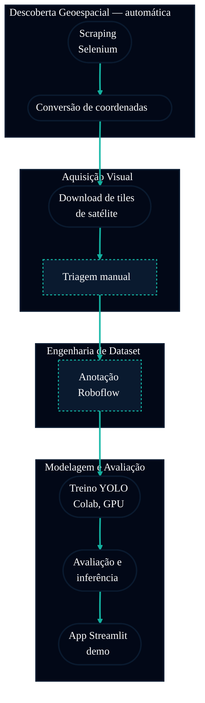

# Guia de Execução — Helipad Detector

Guia passo a passo para rodar o pipeline completo do projeto, do zero até o app funcionando,
incluindo a automação extra de geolocalização de helipontos via web scraping.

> Repositório: `https://github.com/Mindful-AI-Assistants/3-project-ai-ml-yolo-helipoint-detector-New`

---

## 0. Visão geral do pipeline



*Nós com borda tracejada marcam as etapas manuais/humanas (triagem visual, anotação no Roboflow)
— todos os outros rodam automaticamente.*

Este guia segue exatamente essa ordem. As etapas 1 e 2 são o **recurso extra de automação**
que o grupo desenvolveu além do mínimo do briefing — por isso recebem uma seção mais detalhada.

---

## 1. Pré-requisitos

```bash
git clone https://github.com/Mindful-AI-Assistants/3-project-ai-ml-yolo-helipoint-detector-New.git
cd 3-project-ai-ml-yolo-helipoint-detector-New

python3 -m venv .venv
source .venv/bin/activate
pip install -r requirements.txt
```

Para a etapa de scraping (seção 2), você também precisa de:
- **Firefox** instalado
- **geckodriver** (driver do Selenium para Firefox) — instale via `brew install geckodriver` no macOS, ou baixe em https://github.com/mozilla/geckodriver/releases

---

## 2. Automação extra — localização de helipontos via Selenium

### 2.1 O problema que essa automação resolve

Antes de qualquer imagem de satélite poder ser baixada, é preciso saber **onde** os helipontos
estão — latitude e longitude de cada um. Sem automação, isso significa abrir manualmente o site
de referência de aeródromos (FlightMarket), navegar aeroporto por aeroporto, e copiar à mão a
coordenada de cada heliponto encontrado. Para cobrir várias regiões do Brasil isso é lento e
sujeito a erro de digitação — o tipo de trabalho repetitivo que não escala.

O script `src/geospatial/helipad_scraper.py` substitui essa busca manual por um robô que:

1. abre cada página de estado no site (`/pt/aeroportos/<UF>`) e coleta os códigos ICAO de todos os aeródromos listados, navegando/paginando automaticamente;
2. visita a página de cada aeródromo e verifica pelo título/texto se é de fato um **heliponto** (não um aeroporto convencional);
3. extrai a coordenada em formato DMS (graus/minutos/segundos) do texto da página com uma expressão regular tolerante a variações de formatação;
4. faz **geocodificação reversa** via Nominatim/OpenStreetMap para descobrir o nome do bairro/região daquela coordenada (com fallback para o nome da cidade do próprio site, e por último o código ICAO, se a geocodificação falhar);
5. grava cada heliponto encontrado, incrementalmente, em um CSV — então mesmo que o processo seja interrompido no meio, o progresso não se perde.

### 2.2 Como rodar

```bash
python src/geospatial/run_scraping_pipeline.py
```

Esse comando único roda o scraper abaixo **e em seguida** a conversão de coordenadas
(seção 3) automaticamente, em sequência — não precisa rodar como dois passos separados.
Pra rodar só o scraper sozinho (por exemplo, pra customizar a busca), ainda dá pra chamar
ele direto:

```bash
python src/geospatial/helipad_scraper.py
```

O script primeiro pergunta interativamente quantos helipontos você quer coletar (1 a 500).
Em seguida aceita parâmetros opcionais de linha de comando:

```bash
python src/geospatial/helipad_scraper.py \
  --estados RJ MG RS \
  --output src/geospatial/helipad_coordinates_raw.csv \
  --delay 1.5 \
  --geocode
```

| Parâmetro | Efeito |
|---|---|
| `--estados` | Lista de siglas de estado a varrer (SP é sempre ignorado — o perímetro de estudo do projeto já é coberto separadamente) |
| `--output` | Caminho do CSV de saída |
| `--no-headless` | Mostra o Firefox na tela em vez de rodar invisível (útil para depurar) |
| `--delay` | Pausa em segundos entre requisições, para não sobrecarregar o site |
| `--geocode` | Ativa a busca de bairro real via Nominatim (mais precisa, mas mais lenta: ~1 requisição/segundo) |

### 2.3 Saída

Um CSV com 3 colunas:

| Coluna | Conteúdo |
|---|---|
| `Carimbo de data/hora` | Quando aquele heliponto foi coletado |
| `Coordenadas da Bounding Box` | Coordenada em DMS, ex: `23°33'12"S 46°38'01"W` |
| `Nome do Bairro` | Bairro/região identificado via geocodificação |

### 2.4 Ganho real dessa automação

- **Escala**: cobrir 15 estados manualmente, aeroporto por aeroporto, levaria dias; o script roda isso em background.
- **Consistência**: elimina erro de digitação de coordenada, o problema mais comum em coleta manual de dados geográficos.
- **Rastreabilidade**: cada heliponto sai com data/hora de coleta e nome de bairro já resolvido, pronto para a próxima etapa.

---

## 3. Conversão de coordenadas em bounding box geográfico

O `helipad_scraper.py` entrega um **ponto** (lat/lon). Mas para baixar tiles de satélite
precisamos de uma **área** ao redor desse ponto. É isso que `transform_coordinates.py` faz.

Se você usou o `run_scraping_pipeline.py` na seção 2, esse passo já rodou automaticamente.
Pra rodar ele sozinho:

```bash
python src/geospatial/transform_coordinates.py
```

O que ele faz, linha por linha:

1. lê o CSV bruto (`helipad_coordinates_raw.csv`);
2. converte cada coordenada de DMS para graus decimais;
3. aplica uma margem de `±0.0005°` (≈ 55 metros) ao redor do ponto, gerando um retângulo `(lon_min, lat_min, lon_max, lat_max)`;
4. grava o resultado em `src/geospatial/helipad_coordinates_bbox.csv` — este é o arquivo que a próxima etapa (download de tiles) realmente usa.

---

## 4. Download de tiles de satélite

Notebook: `src/geospatial/geospatial_image_collection.ipynb`

1. Abra o notebook (localmente ou no Colab — esta etapa não precisa de GPU, é só download HTTP).
2. Ele lê `helipad_coordinates_bbox.csv`.
3. Para cada bounding box, converte para índices de tile XYZ (`z=19`, o zoom recomendado para alvos pequenos como helipontos) via a função `deg2tile`.
4. Baixa cada tile do **ESRI World Imagery** (fonte pública, com atribuição obrigatória — ver seção "Image Attribution" do README).
5. Monta mosaicos por bairro/região, prontos para triagem visual.

---

## 5. Triagem manual + upload no Roboflow

Esta etapa é manual por design — é aqui que uma pessoa olha os mosaicos gerados e descarta
tiles sem heliponto visível, mantendo apenas imagens relevantes.

1. Abra os mosaicos gerados em `data/tiles/`.
2. Selecione os tiles com heliponto claramente visível.
3. Faça upload dessas imagens no projeto Roboflow do grupo.
4. No Roboflow: desenhe as bounding boxes (classe única `heliponto`), configure resize `640×640`, augmentations (rotação, flip, brilho/contraste), e o split `70/20/10` (train/valid/test).
5. Exporte no formato **YOLOv8**.
6. Baixe o pacote exportado para dentro de `data/training/yolo_dataset/` (ele já vem com a estrutura `train/`, `valid/`, `test/`, `data.yaml`).

---

## 6. Treino do modelo YOLO

> [!WARNING]
> Rode esta etapa no **Google Colab** (GPU T4 grátis), não localmente — treino é GPU-bound e
> as máquinas da equipe (Apple Silicon, sem CUDA) tornam isso impraticável em CPU. Detalhes da
> justificativa completa estão no `README.md`, seção "Why Google Colab instead of a local machine".

### Experimento 1 (já concluído)

Notebook: `src/training/yolo_training.ipynb` — 60 épocas, `yolov8n`, seed 42.
Resultado salvo em `artifacts/runs/detect/exp1/`.

### Experimento 2 (para rodar)

Notebook: `src/training/yolo_training_exp2.ipynb` — idêntico ao exp1, exceto **épocas: 60 → 100**,
para testar se treinar mais tempo melhora, mantém, ou piora as métricas (risco de overfitting
num dataset pequeno). O notebook já inclui, na última célula, a comparação automática entre
`exp1` e `exp2` depois que os dois `results.csv` existirem localmente.

Depois de rodar no Colab, baixe o zip gerado e descompacte em:
```
artifacts/runs/detect/exp2/
```

---

## 7. Avaliação e inferência

Notebook: `notebooks/model_analysis.ipynb`

- carrega o(s) modelo(s) treinado(s);
- gera curvas de loss, precision/recall, mAP;
- monta a matriz de confusão;
- roda inferência em `data/inference/unseen_neighborhood/` — o bairro **fora** do treino, para testar generalização de verdade.

---

## 8. App de demonstração (Streamlit)

```bash
streamlit run apps/streamlit_app/app.py
```

O app:
- descobre automaticamente todos os experimentos com `best.pt` pronto em `artifacts/runs/detect/` e lista no seletor da barra lateral (então `exp2`, uma vez treinado, aparece sozinho, sem editar código);
- permite upload de imagem ou busca por região via bounding box de lat/lon, baixando e analisando tiles ESRI em tempo real;
- mostra as detecções com confiança ajustável.

---

## Resumo — o que é automático vs. manual

| Etapa | Automático | Manual |
|---|:---:|:---:|
| Localizar helipontos (coordenadas) | ✅ Selenium | |
| Converter coordenada em bounding box | ✅ script | |
| Baixar tiles de satélite | ✅ notebook | |
| Triagem visual de qualidade | | ✅ humano |
| Anotação de bounding box | | ✅ humano (Roboflow) |
| Treino do modelo | ✅ notebook (Colab) | |
| Avaliação quantitativa | ✅ notebook | |
| Análise qualitativa de erros | | ✅ humano |

A automação via Selenium (seção 2) e a conversão de coordenadas (seção 3) são exatamente o
**recurso extra** do grupo além do mínimo do briefing: eliminam a etapa que antes era feita
"na mão", aeroporto por aeroporto, e a transformam num processo repetível e rastreável.
